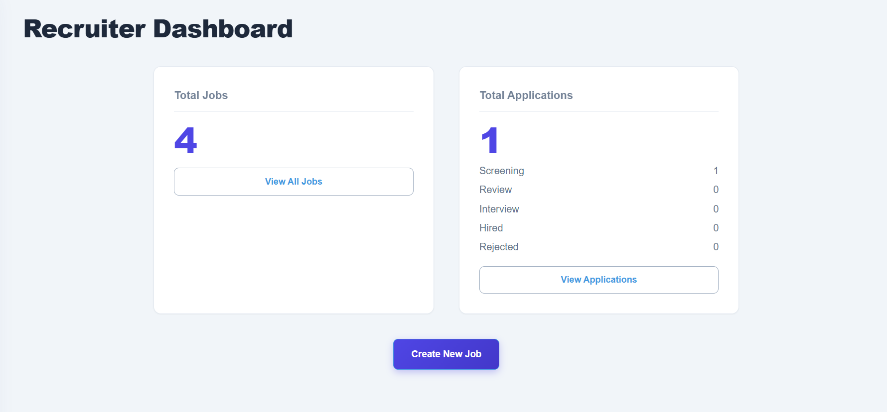
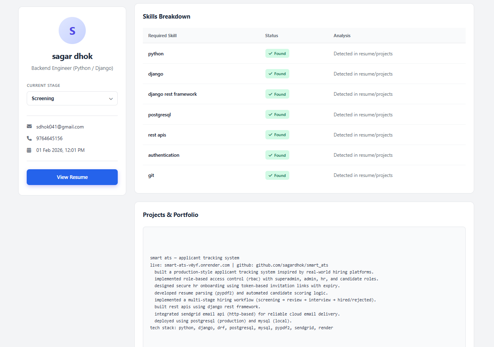
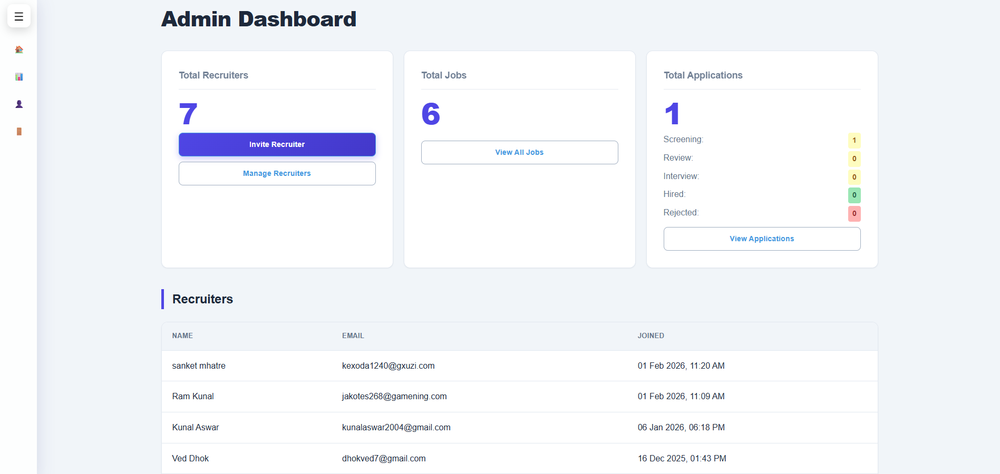

# Smart ATS


**Production Deployment**: [smart-ats-v0yf.onrender.com](https://smart-ats-v0yf.onrender.com)

---

## Overview

Smart ATS is an **internal recruitment management system** demonstrating production-grade Django backend patterns. Built for single-organization hiring workflows, it handles the complete pipeline from job posting through candidate evaluation.

**Core Focus**: RBAC enforcement, secure invite-based onboarding, intelligent resume processing with error recovery, and cloud-native storage architecture.

---

## Screenshots

### Recruiter Dashboard


### Recruiter Jobs


### Resume Parsing & Match Scoring

**Top-level match scores derived from skills, experience, and job description analysis*


*Parsed resume data showing extracted skills, projects, and education*


### Admin Overview

*Admin view showing visibility across recruiters, jobs, and applications*


---

## System Architecture

### 4-Tier Role Hierarchy

```
SUPERUSER → Creates Admins via Django shell
    ↓
ADMIN → Invites Recruiters (UUID token + 48h expiry)
  ↓
RECRUITER → Creates jobs, reviews applications (own jobs only)
    ↓
CANDIDATE → Applies without account (public job listings)
```

**Data Isolation**: Recruiters access applications via role-enforced querysets (`job__created_by=request.user`), not URL manipulation checks.

**Terminology**: "Recruiter" (not "HR") reflects talent acquisition focus, not broader HR functions like payroll or compliance.

📖 **Details**: [docs/architecture.md](docs/architecture.md)

---

## Key Backend Engineering Highlights

### 1. **Secure Invite System**
- UUID tokens (cryptographically random, 48-hour expiry)
- IP address + User-Agent tracking for audit trail
- Brevo HTTP API email delivery (avoids SMTP firewall issues on cloud platforms)
- `consumed_at` timestamp prevents token reuse

### 2. **Production-Safe Resume Parser**
- **Handles encrypted PDFs**: Attempts `decrypt('')`, gracefully fails if password-protected
- **Per-page error recovery**: Continues parsing if one page corrupted
- **Max 20-page limit**: Prevents memory exhaustion
- **100+ skill database** with synonym mapping (`"drf"` → `"django rest framework"`)

### 3. **Weighted Scoring Algorithm**
- **50% Skills**: Set intersection with normalization
- **30% Experience**: Penalties for over/under-qualification
- **20% JD Keywords**: Contextual match
- Returns matched + missing skills for recruiter insight

📖 **Details**: [docs/scoring.md](docs/scoring.md)

### 4. **Cloud-Native Storage (Supabase)**
- **Problem**: Render uses ephemeral filesystems—uploaded files disappear on redeploy
- **Solution**: Object storage with URL references (`resume_url = models.URLField()`)
- Persistent across deployments, CDN-backed, easy S3 migration path

📖 **Details**: [docs/storage.md](docs/storage.md)

### 5. **Security Patterns**
- **Rate limiting**: 5 login attempts/minute per IP (production only)
- **Soft delete**: `is_deleted` flag preserves referential integrity
- **Custom DRF permissions**: `IsRecruiter`, `IsAdmin` enforce role boundaries
- **Environment-aware config**: Rate limiting, Redis cache, SSL connections enabled conditionally

### 6. **Database Design**
- **Custom User model**: Email-based auth (no username field)
- **JSON fields**: Flexible skill storage (no migrations for new skills)
- **Unique constraints**: Prevents duplicate applications (`unique_together`)
- **DecimalField for money**: Avoids floating-point precision issues

---

## Tech Stack

| Layer | Technology | Rationale |
|-------|------------|-----------|
| **Backend** | Django 5.2 | ORM, built-in admin, security defaults |
| **API** | DRF 3.14 | Token auth, serializers, permissions |
| **Database** | PostgreSQL (Neon), MySQL (local) | JSONB support, production reliability |
| **Cache** | Redis (prod), LocMem (dev) | Rate limiting backend |
| **Storage** | Supabase | Ephemeral filesystem resilience |
| **Email** | Brevo HTTP API | Cloud-friendly transactional emails |
| **Static** | WhiteNoise | Compressed, versioned files |
| **Deploy** | Render | Free tier with production config |

---

## Production & Deployment Mindset

### Environment-Aware Configuration
```python
if ENVIRONMENT == "production":
    # Rate limiting enabled
    # Redis cache
    # PostgreSQL SSL required
else:
    # No rate limiting, LocMem cache, permissive settings
```

### Design Decisions Made

**Email-based auth**: Primary identifier in recruitment systems; usernames add complexity  
**UUID tokens**: Prevents enumeration attacks (not sequential IDs)  
**Soft delete**: Preserves audit trail for "deleted" jobs  
**JSON fields**: Schema flexibility without migrations  
**Cloud storage**: Standard solution for ephemeral filesystems

### Challenges Solved

**Render file persistence** → Discovered ephemeral storage limitation → Migrated to Supabase  
**SMTP blocking** → Found Brevo HTTP API → Implemented request-based email  
**Encrypted PDFs** → Researched PyPDF2 methods → Added graceful decryption fallback

---

## What This Project Demonstrates

**Not a Tutorial CRUD App**—This shows:

✅ **Production constraints**: Ephemeral storage, rate limiting, cloud deployment  
✅ **Security by default**: UUID tokens, IP tracking, role-enforced queries  
✅ **Error recovery**: Encrypted/corrupted PDFs, missing data, edge cases  
✅ **Schema evolution**: Soft delete, JSON flexibility, audit trails  
✅ **Real recruitment logic**: Weighted scoring (explainable, not "AI magic"), overqualification penalties

---

## Live Demo Credentials

**Admin**:
```
Email: admin@demo.com
Password: admin@123
```

**Recruiter**:
```
Email: dhokved7@gmail.com
Password: ved@1234
```

**Test Flow**: Admin → Invite Recruiter → Create Job → Browse Jobs (Guest) → Apply → View Parsed Resume + Score

---

## Local Setup

```bash
git clone https://github.com/SagarDhok/Smart_ATS.git
cd Smart_ATS/backend

python -m venv env
source env/bin/activate  # Windows: env\Scripts\activate

pip install -r requirements.txt

# Configure .env with database credentials
python manage.py migrate
python manage.py createsuperuser
python manage.py runserver
```

Visit: [http://127.0.0.1:8000](http://127.0.0.1:8000)

---

## Future Enhancements

**Intentionally Not Implemented** (scope reduction):
- Email notifications on status change (requires Celery)
- Interview scheduling, multi-stage pipelines
- Resume ranking dashboard

**Technical Debt**:
- Database indexes for common queries
- API pagination, Swagger docs
- Test coverage (unit + integration)

---

## Developer

**Sagar Dhok**  
Backend Developer | Python • Django • REST APIs • PostgreSQL

- **GitHub**: [github.com/SagarDhok](https://github.com/SagarDhok/Smart_ATS)
- **LinkedIn**: [linkedin.com/in/sagardhok](https://www.linkedin.com/in/sagardhok/)
- **X**: [x.com/SagarDh0k](https://x.com/SagarDh0k)
- **Email**: sdhok041@gmail.com

---

## License

Open-source for educational purposes. Portfolio project demonstrating backend engineering—not intended for commercial deployment without additional hardening.
