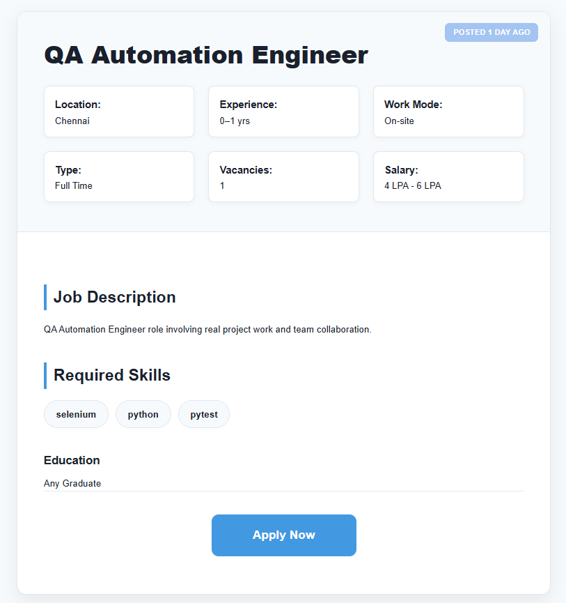
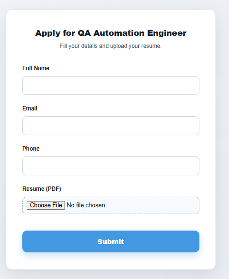
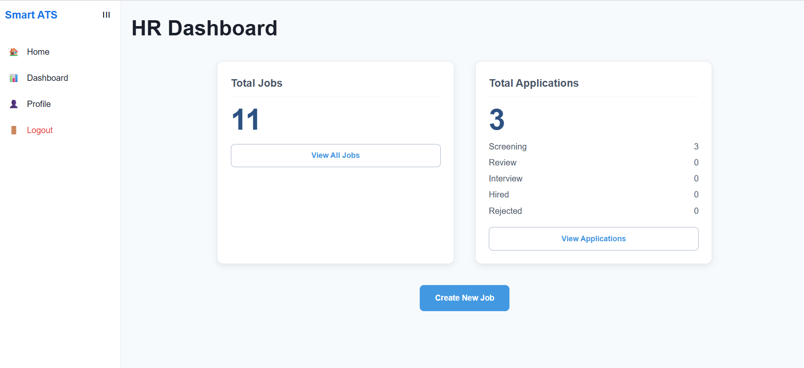
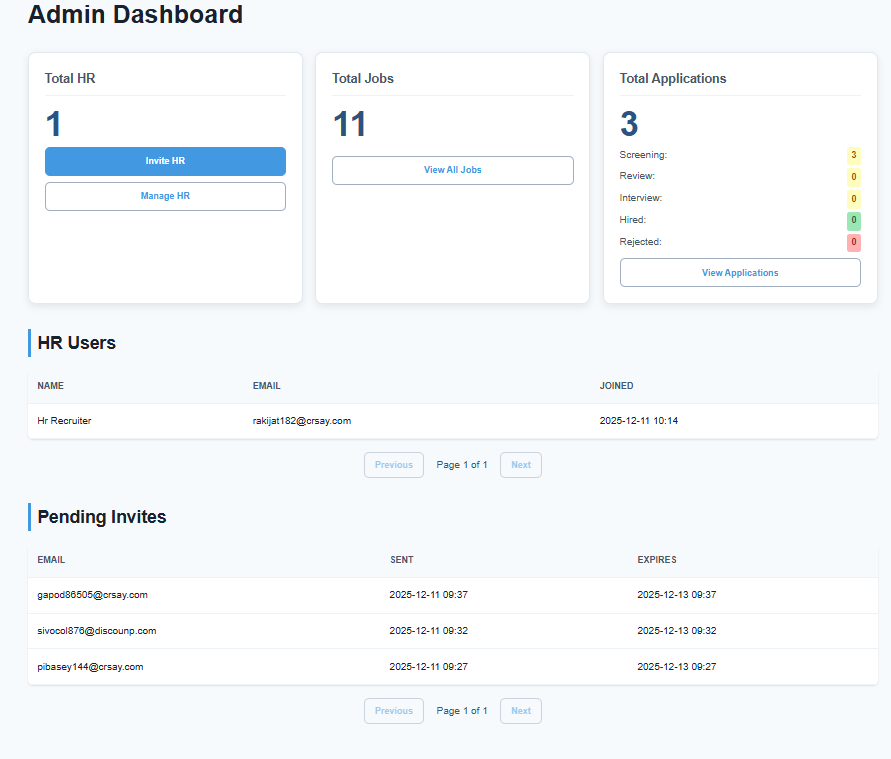
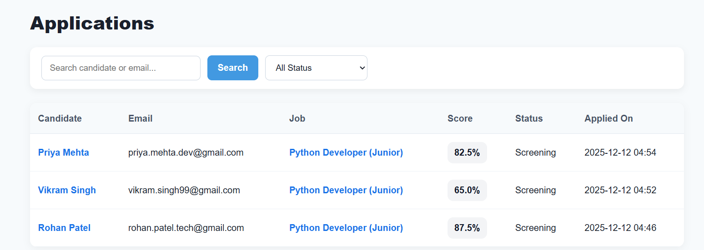
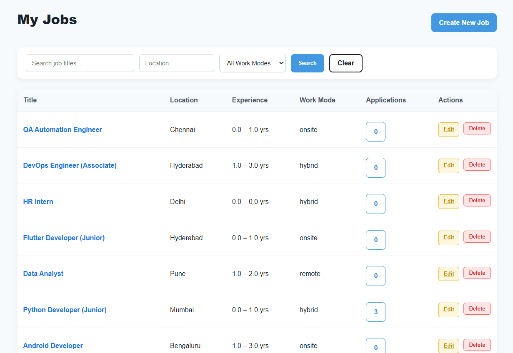

# 🚀 Smart ATS — Enterprise Applicant Tracking System


A **production-grade Applicant Tracking System (ATS)** built with **Django, MySQL, and Django REST Framework**. Implements enterprise-style hiring workflows inspired by platforms like Greenhouse, Lever, and Workable.

**Smart ATS** includes resume parsing, automated candidate scoring, strict Role-Based Access Control (RBAC), secure HR invitation system, and dedicated dashboards for Admin & HR.

### LIVE LINK  : https://smart-ats-v0yf.onrender.com


## 📸 UI Screenshots (Dashboard & Workflows)

### ⭐ Public Jobs List


### 📝 Job Detail Page


### 📤 Apply Form


### 🧑‍💼 HR Dashboard


### 🧑‍💼 Admin Dashboard


### 📊 Applications List


### 🔍 Parsed Resume + Match Scoring


### 🛠️ HR Jobs List



## 🔐 Demo Login Credentials (Local)

### **Admin**
```
Email: admin@demo.com
Password: admin@123
```

### **HR Recruiter**
```
Email: rakijat182@crsay.com
Password: hrrecuiter@123
```


## 🏗️ System Workflow

- **Superadmin** → Creates Admin (via Django Admin)  
- **Admin** → Invites HR (secure token-only, no open signup)  
- **HR** → Posts jobs, screens applicants  
- **Candidates** → Apply without accounts


## 🎯 Key Features

### ✔ **Public Job Portal**
- Browse & filter jobs  
- Job detail view  
- Apply without account  

### ✔ **Resume Parsing (PyPDF2)**
Extracts:
- Name, Email, Phone  
- Skills  
- Experience  
- Education  
- Projects  
- Certifications  

**Safe Handling:**
- Max 5MB file size
- PDF-only uploads
- Detects corrupted/encrypted files
- Sanitized parsing with fallback

### ✔ **Automated Match Scoring**
Weighted scoring algorithm:
- **Skills Match — 50%**  
- **Experience Match — 30%**  
- **JD Keywords — 20%**

**Outputs:**
- Final Score (0-100)
- Category (Strong / Good / Average / Weak)  
- Detailed Summary & Evaluation  

### ✔ **Role-Based Access Control (RBAC)**

| Role          | Key Capabilities                                   | Restrictions                          |
|---------------|----------------------------------------------------|---------------------------------------|
| **Superadmin**| Full system control (Django Admin)                | -                                     |
| **Admin**     | Invite/manage HR, view all data & analytics       | Cannot post jobs or apply             |
| **HR**        | Create/edit jobs, screen applicants               | Cannot download resumes or invite HR  |
| **Candidate** | Apply to jobs                                      | No login required                     |

### ✔ **Secure HR Invitation System**
- UUID token-based signup links
- 48-hour token expiry
- Email delivery via **Brevo Email API (HTTP-based)**
- Prevents unauthorized HR accounts
- Reliable delivery on cloud platforms (Render-compatible)
- High inbox placement for transactional emails


### ✔ **Application Workflow**
Status pipeline:
```
Screening → Review → Interview → Hired / Rejected
```

### ✔ **Additional Features**
- Job postings with required skills, keywords, salary (LPA/Monthly/Negotiable)
- Duplicate application prevention
- Rate-limited login (anti-bruteforce)
- Password strength validation
- 15-minute password reset expiry


## 🧑‍💻 REST API Endpoints (DRF + Token Auth)
> APIs are designed to mirror internal service boundaries and support future frontend or microservice expansion.


### **Authentication**
```
POST /api/auth/login/
POST /api/auth/logout/
GET /api/auth/me/
```

### **Public APIs**
```
GET /api/jobs/
GET /api/jobs/<slug>/
POST /api/apply/<slug>/  # Upload resume + apply
```

### **HR APIs**
```
POST /api/jobs/create/
PUT /api/jobs/<id>/update/
DELETE /api/jobs/<id>/delete/

GET /api/applications/
GET /api/applications/<id>/
PATCH /api/applications/<id>/status/
```


## 🛠️ Tech Stack

| Component | Technology |
|-----------|------------|
| Backend | Django 5.2 |
| Resume Parsing | PyPDF2 |
| APIs | Django REST Framework 3.14 |
| Frontend | Django Templates + CSS/JS |
| Authentication | DRF Token Authentication |
| File Storage | Supabase Storage (Object Storage) |
| Database | PostgreSQL (Neon – Production), MySQL (Local)|
| Logging | Python logging (structured, environment-aware) |
| Email System | Brevo Email API (HTTP-based, production-safe) |


## 🔒 Security Highlights
- CSRF protection
- Secure token workflows
- Rate-limited authentication
- Password strength validation
- Sanitized file uploads
- Structured logging (app.log, error.log)


## 📂 Project Structure

```
Smart-ATS/
│
├── core/               # Settings, URLs, logging config
├── users/              # Custom user model + HR/Admin roles + invites
├── jobs/               # Job model + CRUD logic
├── applications/       # Parsing + scoring + application workflow
├── api/                # REST API Layer
│
├── templates/          # UI pages
├── static/             # CSS / JS / Assets
├── logs/               # app.log + error.log
│
├── requirements.txt
├── manage.py
└── README.md
```

## 🖥️ UI & Responsiveness (Supporting Layer)

The UI is intentionally kept simple and framework-free to **support backend workflows**, not to showcase frontend design.

- Server-rendered Django templates
- Responsive layout for basic mobile usability
- Sidebar-based navigation for role-specific dashboards
- Focus on data flow, forms, and system interaction

> The primary focus of this project is **backend architecture, security, and workflow automation**.

## 📦 File Storage & Resume Handling

Resume files are stored using **Supabase Storage (Object Storage)** instead of the application server filesystem.

### Why Supabase Storage?
- Cloud platforms like **Render (Free Tier)** use **ephemeral filesystems**
- Uploaded files do not persist across redeploys or restarts
- Supabase provides **persistent, production-grade object storage**
- Tight integration with PostgreSQL-based backends
- Simple public URL access for controlled resume viewing

### How it works
- Resume files are uploaded to a **Supabase public bucket**
- Files are organized by job slug for isolation
- Django stores only the **resume URL** (`resume_url`)
- Resume preview opens in-browser
- Resume download is handled via backend-controlled streaming
- No dependency on local disk or media server

### Benefits
- Persistent storage across deployments
- CDN-backed fast resume access
- Works reliably on Render free tier
- Clear separation of compute (Django) and storage (Supabase)
- Easily replaceable with AWS S3 / GCS in large-scale setups

> This mirrors real-world production systems where user-uploaded documents
> are stored in object storage rather than application servers.


## ⚙️ Installation & Setup

### 1️⃣ Clone Repository
```bash
git clone https://github.com/SagarDhok/Smart_ATS.git
cd Smart_ATS/backend
```

### 2️⃣ Create Virtual Environment
```bash
python -m venv env
```

**Activate environment:**

Windows:
```bash
env\Scripts\activate
```

macOS/Linux:
```bash
source env/bin/activate
```

### 3️⃣ Install Dependencies
```bash
pip install -r requirements.txt
```

### 4️⃣ Create `.env` File
Create a file named `.env` in the root directory:

```ini
SECRET_KEY=your-secret-key
DB_NAME=smart_ats
DB_USER=root
DB_PASSWORD=1234
DB_HOST=127.0.0.1
DB_PORT=3306

EMAIL_HOST_USER=your-gmail-address
EMAIL_HOST_PASSWORD=your-gmail-app-password

DEBUG=True
ALLOWED_HOSTS=127.0.0.1,localhost
```

### 5️⃣ Apply Migrations
```bash
python manage.py makemigrations
python manage.py migrate
```

### 6️⃣ Start Development Server
```bash
python manage.py runserver
```

**Visit:** 👉 http://127.0.0.1:8000


## 💡 Testing the System

> **Test Secure Invite Flow**: Log in as Admin → Invite HR → Use any email (or temp mail) to receive the tokenized signup link.


## 👨‍💻 Developer

**Sagar Dhok**  
Backend Developer (Python • Django • REST APIs • MySQL)

- 🌐 GitHub: [github.com/SagarDhok](https://github.com/SagarDhok)
- 💼 LinkedIn: [linkedin.com/in/sagardhok](https://linkedin.com/in/sagardhok)
- 📧 Email: sdhok041@gmail.com


## 🎯 Why This Project?
## 🎯 Why I Built This Project

Most beginner backend projects stop at basic CRUD.

I wanted to build something closer to how **real hiring systems work internally**, where:
- not everyone can sign up freely
- roles have strict boundaries
- uploaded files cannot live on the application server
- resumes must be parsed safely, not blindly trusted
- scoring logic must be explainable, not just “AI magic”

This project forced me to think about:
- RBAC edge cases
- invite-based onboarding flows
- production deployment constraints (Render, Neon, cloud storage)
- schema evolution & migrations
- handling broken, encrypted, or malformed PDFs safely

Smart ATS represents how I approach backend systems:  
**secure first, boring where needed, explicit over clever.**


## 🏁 Conclusion

**Smart ATS** is a complete enterprise-grade recruitment platform demonstrating:

- ✅ Secure RBAC system
- ✅ HR onboarding via token invites
- ✅ Intelligent resume parsing
- ✅ Automated candidate scoring
- ✅ Production-ready Django architecture

