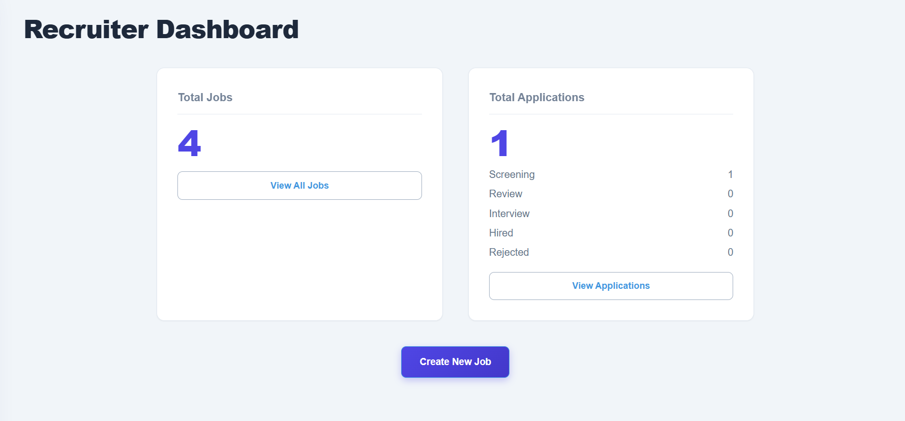
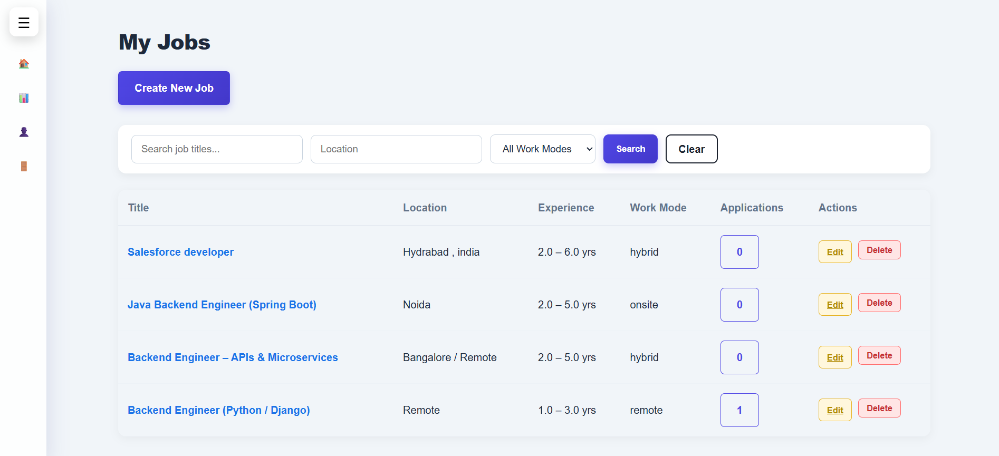
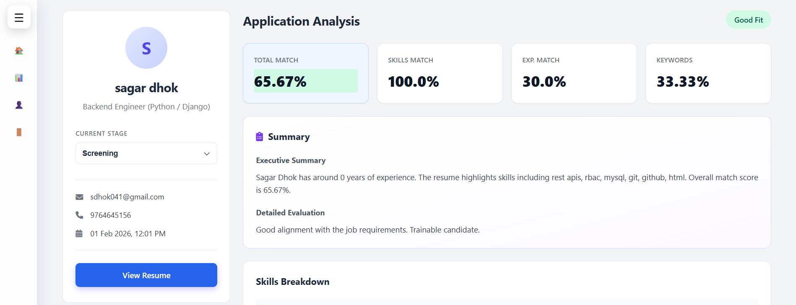
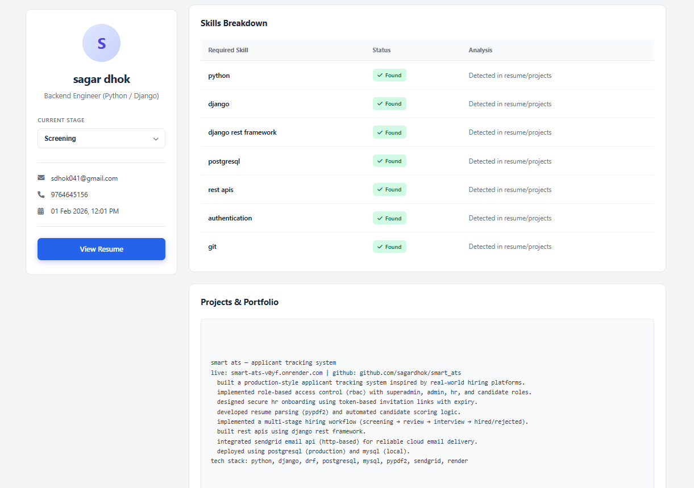

# Smart ATS Backend

Production-style Applicant Tracking System backend built with Django and DRF for internal hiring teams.

This project demonstrates secure multi-role workflows, resume parsing, automated candidate scoring, and clean API + server-rendered architecture.


---

## Why This Project Stands Out

- Built a complete ATS workflow end-to-end: recruiter onboarding, job posting, candidate applications, resume intelligence, and hiring-stage tracking.
- Enforced strict role boundaries with custom RBAC (`ADMIN`, `RECRUITER`) at authentication, view-authorization, API, and queryset layers.
- Implemented resilient candidate ingestion with PDF parsing, cloud resume storage (Supabase), and weighted fit scoring.
- Added invite-only recruiter onboarding and secure password reset flows with expiring UUID tokens.
- Covered critical paths with automated tests for auth, permissions, application flow, and data isolation.

---

## Core Product Workflow

1. Admin invites recruiter using a secure expiring link.
2. Recruiter signs up and creates jobs.
3. Candidate applies with contact info + PDF resume (no candidate account required).
4. System parses resume, computes weighted match score, and stores recruiter-facing evaluation.
5. Recruiter moves candidate through pipeline: `screening -> review -> interview -> hired/rejected`.

---

## Key Engineering Highlights

### 1) Role-Based Access Control and Data Isolation
- Built layered backend access control, not frontend-only checks.
- Authentication is enforced with Django `@login_required` on protected routes.
- Authorization is enforced with role checks (`request.user.role`) before executing business logic.
- Fail-closed behavior is applied using `PermissionDenied` / forbidden responses for unauthorized access attempts.
- Data isolation is enforced via ownership-based querysets so recruiters cannot access other recruiters' jobs/applications.
- DRF permission classes (`IsAdmin`, `IsRecruiter`) additionally secure API endpoints.

### 2) Invite-Only Team Onboarding
- Recruiter signup is restricted to admin-issued UUID invite tokens.
- Invite links expire (48 hours) and are marked as used after successful signup.
- Duplicate active invites are blocked.

### 3) Secure Authentication and Recovery
- Token-based API authentication (`rest_framework.authtoken`).
- Forgot/reset password flow with expiring reset tokens (15 minutes).
- `must_change_password` workflow for forced first-login resets.
- Inactive users are blocked from login.

### 4) Resume Parsing + Automated Evaluation
- PDF-only application uploads with validation (extension + size limits).
- Resume parser extracts:
  - name, email, phone
  - skills
  - experience
  - projects, education, certifications
- Weighted scoring engine:
  - 50% skill match
  - 30% experience fit
  - 20% job-description keyword relevance
- Stores final score + matched/missing skills + fit category + summary/evaluation text.

### 5) Cloud Storage and Transactional Email Integration
- Resume uploads persisted to Supabase object storage, URL stored in DB.
- Invite and password-reset emails sent through Brevo HTTP API with explicit timeout and failure handling.

### 6) Operational Safety
- Soft-delete strategy for jobs (`is_deleted`) to preserve historical application data.
- Cache-control middleware to prevent sensitive authenticated pages from being cached.
- Structured logging for login failures, permission violations, and external integration failures.

---

## Tech Stack

- **Backend**: Django 5.2.8, Django REST Framework 3.16.1
- **Database**: PostgreSQL (SQLite test DB fallback during test runs)
- **Resume Parsing**: PyPDF2 + regex extractors
- **File Storage**: Supabase Storage
- **Email**: Brevo API
- **Static Serving**: WhiteNoise
- **Deployment**: Gunicorn + Render
- **Testing**: Django TestCase + DRF APIClient

---

## API Surface (Representative)

### Auth
- `POST /api/auth/login/`
- `POST /api/auth/logout/`
- `GET /api/auth/me/`

### Public
- `GET /api/jobs/`
- `GET /api/jobs/<slug>/`
- `POST /api/apply/<slug>/`

### Recruiter
- `GET /api/recruiter/jobs/`
- `POST /api/recruiter/jobs/create/`
- `PUT /api/recruiter/jobs/<id>/update/`
- `DELETE /api/recruiter/jobs/<id>/delete/`
- `GET /api/recruiter/applications/`
- `PATCH /api/recruiter/applications/<id>/status/`

### Admin
- `GET /api/admin/jobs/`
- `GET /api/admin/jobs/<id>/`
- `GET /api/admin/applications/`
- `GET /api/admin/applications/<id>/`

---

## Project Structure

```text
backend/
├── api/               # DRF endpoints, serializers, role permissions
├── users/             # custom user model, auth, invite, password reset flows
├── jobs/              # job model, forms, recruiter/admin/public job views
├── applications/      # application model, parsing, scoring, storage integration
├── core/              # settings, URL router, Brevo utility, CSRF view
├── middleware/        # no-cache middleware for sensitive pages
└── templates/         # recruiter/admin/public server-rendered UI templates
```

---

## Local Setup

```bash
git clone <your-repo-url>
cd Smart_ATS/backend
python -m venv env
source env/bin/activate  # Windows: env\Scripts\activate
pip install -r requirements.txt
```

Create `.env` with required values:

```env
ENVIRONMENT=development
SECRET_KEY=your-secret

DB_NAME=your_db
DB_USER=your_user
DB_PASSWORD=your_password
DB_HOST=your_host
DB_PORT=5432

BREVO_API_KEY=your_brevo_key
DEFAULT_FROM_EMAIL=your_sender_email

SUPABASE_URL=your_supabase_url
SUPABASE_KEY=your_supabase_key
SUPABASE_BUCKET=resumes
```

Run:

```bash
python manage.py migrate
python manage.py createsuperuser
python manage.py runserver
```

---

## Tests

Run all tests:

```bash
python manage.py test
```

Targeted suites:

```bash
python manage.py test users.tests
python manage.py test jobs.tests
python manage.py test applications.tests
python manage.py test api.tests
```

---

## Deployment Notes

- `render.yaml` includes a Gunicorn start command and static collection step.
- App uses environment-driven settings for host/security/database configuration.
- PostgreSQL with SSL mode is enabled in settings for secure DB connections.

---

## Screenshots






---

## About the Developer

I built this project to demonstrate practical backend engineering for real hiring workflows:
- API design with strict authorization
- data modeling and workflow integrity
- third-party service integration
- test-driven reliability for critical flows

If you are hiring for Python/Django backend roles, this repository is meant to show production-minded implementation quality rather than tutorial-level CRUD.
