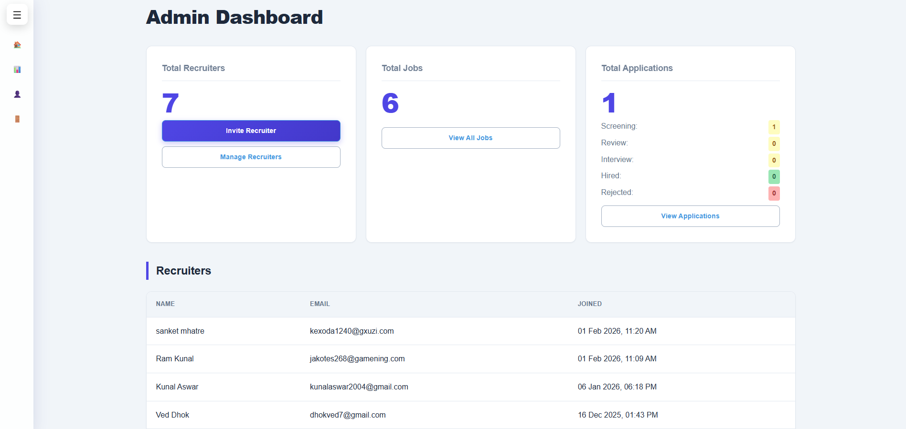

# Smart ATS


**Production Deployment**: [smart-ats-v0yf.onrender.com](https://smart-ats-v0yf.onrender.com)

---

## Overview

Smart ATS is an **internal recruitment management system** demonstrating production-grade Django backend patterns. Built for single-organization hiring workflows, it handles the complete pipeline from job posting through candidate evaluation.

**Core Focus**: Strict RBAC enforcement, secure invite-based onboarding, intelligent resume processing with error recovery, and cloud-native storage architecture.

---

## Screenshots

### Recruiter Dashboard


### Recruiter Jobs


### Resume Parsing & Match Scoring

*Top-level match scores derived from skills, experience, and job description analysis*


*Parsed resume data showing extracted skills, projects, and education*

### Admin Overview

*Admin view showing visibility across recruiters, jobs, and applications*

---

## System Architecture

### 2-Tier Business Role Hierarchy

This system implements a strict permission model with two primary business roles.

```
ADMIN (Manager)
  │
  └── RECRUITER (Hiring Staff)
```

**Role Breakdown:**
1. **ADMIN**: Manages the recruitment team. Invites Recruiters via secure UUID tokens (48h expiry). Can view all jobs and applications across the organization.
2. **RECRUITER**: Operational role. Can create jobs and review applications. Limited to viewing only *their own* jobs and applicants (`job__created_by=request.user`) for strict data isolation.

*Note: **SUPERUSER** is a Django built-in role reserved solely for system owner tasks (like accessing the Django Admin Panel) and is not part of the recruitment workflow.*

**Authorization Enforcement**:
- **API Level**: Uses strict `permission_classes` (`IsRecruiter`, `IsAdmin`).
- **View Level**: `request.user.role` checks prevent unauthorized actions.
- **ORM Level**: Custom QuerySets enforce data isolation (`Application.objects.filter(job__created_by=request.user)`).
- **Security**: Unauthorized access attempts return `403 Forbidden`.

**Candidate Interaction**: Candidates do **not** have accounts. They interact with public job listings and apply purely via email/resume submission, receiving application tracking IDs via email.

📖 **Details**: [docs/architecture.md](docs/architecture.md)

---

## Key Backend Engineering Highlights

### 1. **Secure Invite System**
- **UUID Tokens**: Cryptographically random application invites with 48-hour expiry.
- **Audit Trail**: Tracks IP address and User-Agent during improved security monitoring.
- **Token State**: `consumed_at` timestamp ensures one-time use policy, preventing replay attacks.
- **Email Delivery**: Uses Brevo HTTP API (Synchronous) to bypass common cloud SMTP blocks.

### 2. **Production-Safe Resume Parser**
- **Encrypted PDF Handling**: Attempts standard decryption and gracefully fails if password-protected.
- **Per-Page Error Recovery**: Parsing continues even if individual pages are corrupted.
- **Resource Protection**: Enforces 20-page limit to prevent server memory exhaustion.
- **Skill Extraction**: Maps 100+ raw skill terms to canonical forms (e.g., `"drf"`, `"django rest framework"` → `"Django REST Framework"`).

### 3. **Weighted Scoring Algorithm**
- **50% Skills Match**: Set intersection of candidate skills vs. job requirements.
- **30% Experience**: Evaluation of years of experience with penalties for over/under-qualification.
- **20% Keyword Relevance**: Contextual matching against the full job description.
- **Detailed Feedback**: Returns specific matched vs. missing skills to aid recruiter decision-making.

📖 **Details**: [docs/scoring.md](docs/scoring.md)

### 4. **Cloud-Native Storage (Supabase)**
- **Problem**: Host platforms like Render use ephemeral filesystems where uploads vanish on redeploy.
- **Solution**: Integrated Supabase Object Storage.
- **Implementation**: Files are uploaded directly to cloud buckets; database stores permanent URL references. This ensures 100% data persistence across deployments.

📖 **Details**: [docs/storage.md](docs/storage.md)

### 5. **Security & Integrity**
- **Soft Delete**: `is_deleted` flags preserve data referential integrity and audit history.
- **Environment-Aware Config**: auto-switches between Local/Production settings (SSL, Debug mode, Allowed Hosts).
- **Custom Permissions**: `IsRecruiter` and `IsAdmin` DRF permission classes enforce strict role boundaries.

---

## API Structure

The application exposes a structured REST API via **Django Rest Framework (DRF)**.

### **Authentication**
- `POST /api/auth/login/` - Token-based login
- `POST /api/auth/logout/` - Invalidate token
- `GET /api/auth/me/` - User profile & role info

### **Public (Candidates)**
- `GET /api/jobs/` - List open positions
- `GET /api/jobs/<slug>/` - Job details
- `POST /api/apply/<slug>/` - Submit application (Resume Parsing + Scoring trigger)

### **Recruiter Management**
- `POST /api/jobs/create/` - Post new job
- `PUT /api/jobs/<id>/update/` - Edit job details
- `DELETE /api/jobs/<id>/delete/` - Soft delete job
- `GET /api/applications/` - List applicants (Filtered by owned jobs)
- `PATCH /api/applications/<id>/status/` - Update applicant status (e.g., "Interview", "Rejected")

---

## Tech Stack

| Layer | Technology | Rationale |
|-------|------------|-----------|
| **Backend** | Django 5.2 | Robust ORM, built-in admin, security defaults |
| **API** | DRF 3.14 | Token auth, serializers, permissions |
| **Database** | PostgreSQL (Neon) | JSONB support, production reliability |
| **Dev DB** | SQLite / MySQL | Lightweight local development |
| **Parsing** | PyPDF2 + Regex | Efficient, local resume text extraction |
| **Storage** | Supabase | Ephemeral filesystem resilience |
| **Email** | Brevo HTTP API | Reliable transactional emails (Synchronous) |
| **Deployment** | Render | Managed cloud hosting with CI/CD |

---

## Live Demo Credentials

**Admin**:
```
Email: admin@demo.com
Password: admin@123
```

**Recruiter**:
```
Email: dhokved7@gmail.com
Password: ved@1234
```

**Test Flow**: Admin → Invite New Recruiter → Login as Recruiter → Create Job → (Logout/Incognito) Apply as Candidate → Login as Recruiter → Review Application Score.

---

## Local Setup

```bash
git clone https://github.com/SagarDhok/Smart_ATS.git
cd Smart_ATS/backend

# Create virtual environment
python -m venv env
source env/bin/activate  # Windows: env\Scripts\activate

# Install dependencies
pip install -r requirements.txt

# Configure .env file (see .env.example)
# Run migrations
python manage.py migrate

# Create owner account
python manage.py createsuperuser

# Start server
python manage.py runserver
```

Visit: [http://127.0.0.1:8000](http://127.0.0.1:8000)

---

## Developer

**Sagar Dhok**  
Backend Developer | Python • Django • REST APIs • SQL

- **GitHub**: [github.com/SagarDhok](https://github.com/SagarDhok/Smart_ATS)
- **LinkedIn**: [linkedin.com/in/sagardhok](https://www.linkedin.com/in/sagardhok/)
- **X**: [x.com/SagarDh0k](https://x.com/SagarDh0k)
- **Email**: sdhok041@gmail.com

---

## License

Open-source for educational purposes. Portfolio project demonstrating backend engineering—not intended for commercial deployment without additional hardening.
